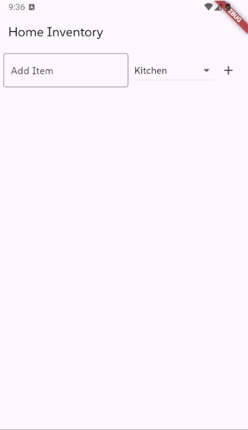
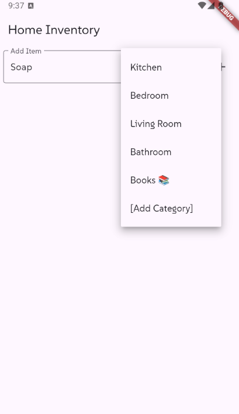
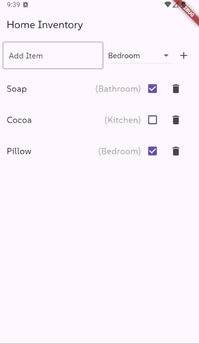
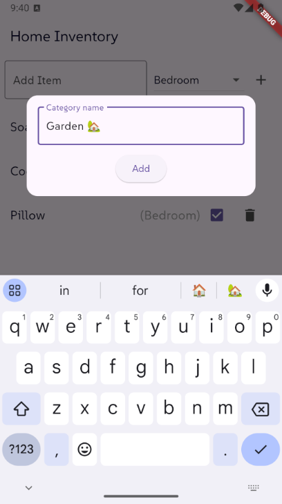
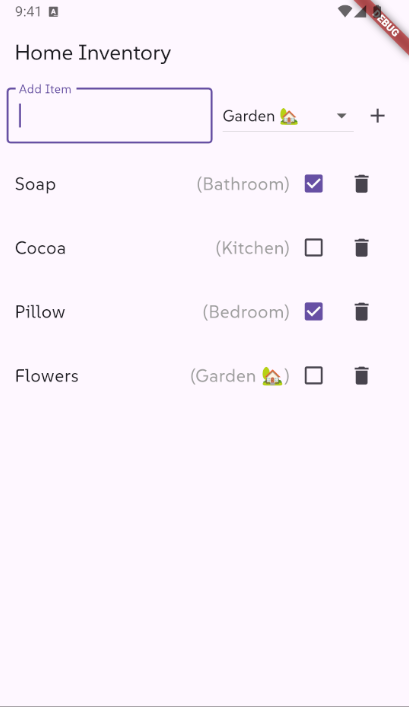
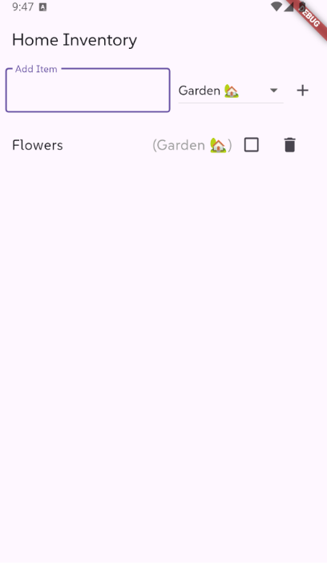

# Home Inventory

A Flutter project to list and manage your home inventory.

## Main page

    
     
    Main page view

## Features

- **Item management**: adding and deleting items assigned to categories

- **Item status**: checking and unchecking owned and unowned items 

- **Category management**: adding adn deleting categories

## Adding new item

    
     
    Adding item view

## Listing items

    
     
    Listed items view

## Adding new category

    
     
    Adding category view

## Adding item with new category

    
     
    New category view

## Deleting items

    
     
    Deleted items view

## 🔜 To be done

- **Enhancing GUI**: Switching to dark-mode feature.